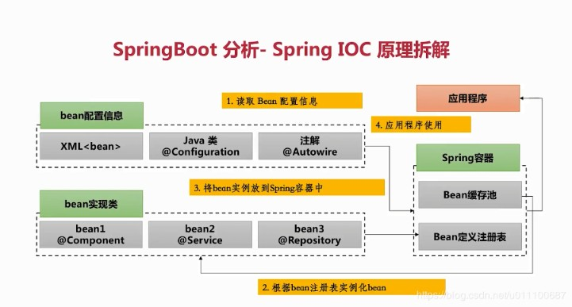
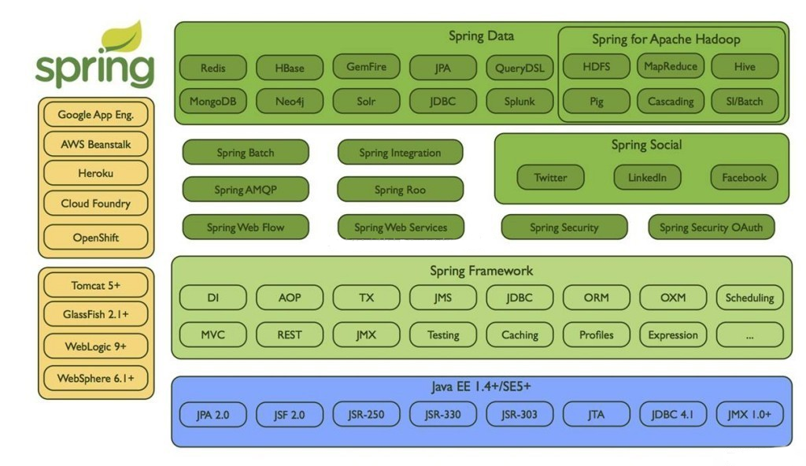

#  Spring-Framework 入門教學
## 一、Spring Framework 簡介
### 1. Spring Framework 是甚麼?
### 
### 2. Spring 的起源
### 3. Spring 的關鍵特性
### 4. Spring 版本歷史
#### 
### 5. Spring 的體系架構
#### 

## 二、Spring 元件與 IOC 容器
### 1. 什麼是 Spring 元件
### 2. 什麼是 IOC 容器
### 3. 元件的標記
### 4. 元件的注入
### 5. 元件的依賴
### 

## 三、Spring Boot
### 1.Spring Boot 簡介
### 2.練習 - 建立一個 Spring Boot 專案
### 

## 四、Dependency Injection
### 1. 什麼是依賴注入?
### 2. 為什麼需要依賴注入?

## 五、Spring AOP
### 1. 什麼是 AOP (面向切面編程)?
### 2. AOP 範例說明
### 3. 練習 - 使用 AOP 進行日誌記錄

## 六、Spring 整合資料庫
### 1. Spring Data Access/Integration 模組簡介
#### (1)Spring-JDBC：提供以JDBC訪問資料庫的支援
#### (2)Spring-TX：提供編程式和宣告式的事務支援
#### (3)Spring-ORM：提供對物件/關係對映技術的支援
#### (4)Spring-OXM：提供對物件/xml對映技術的支援
#### (5)Spring-JMS：提供對Java Message Service 的支援

## 七、交易控管
### 1. 什麼是交易?
### 2. Spring 交易管理的介面說明
### 1. 編程式的交易管理
### 2. 宣告式的交易管理

## 八、Spring Data JPA
### 1. 什麼是 Spring Data JPA
### 2. Spring JPA + Hibernate 範例說明
### 3. 練習 -- 使用 Spring JPA + Hibernate 建立一個學生資料表

## 九、Spring 整合 MongoDB
### 1. MongoDB 簡介
### 2. Spring Data MongoDB + MongoDB 簡單範例
### 3. 練習 -- 註冊 Cloud MongoDB 帳號並建立一個專案Cluster 以及 Collection , 學生資料表,並用 Spring Data MongoDB 連線存取學生資料 

## 十、Spring 與訊息(Message)整合

## 十一、Spring Web MVC

## 十二、Spring Security

## 十三、Spring Batch
