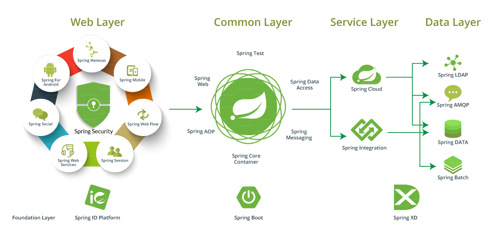

#  一、Spring Framework 簡介
### 1. Spring Framework 是甚麼?
#### Spring Framework 是一個開源的Java／Java EE全功能棧（full-stack）的應用程式框架
### 
### 2. Spring 的起源
#### Spring是於2003年興起的一個輕量級的Java開發框架，由Rod Johnson在其著作Expert One-On-One J2EE Development and Design中闡述的部分理念和原型衍生而來。

### 3. Spring 的關鍵特性
#### Spring Framework 作為一個優秀的開源框架，是為了解決企業應用程式開發複雜性而創建的。框架的主要優勢之一就是其分層架構，分層架構允許您選擇使用哪一個組件，同時為 J2EE 應用程式開發提供集成的框架。

### 4. Spring 版本歷史
#### 

### 5. Spring 的體系架構
#### 

#### (1) Core Container
##### Core Container（核心容器）包含有Core、Beans、Context和Expression Language模塊。
##### Core和Beans模塊是框架的基礎部分，提供IoC（轉控制）和依賴注入特性。
##### 這裡的基礎概念是BeanFactory，它提供對Factory模式的經典實現來消除對程序性單例模式的需要，並真正地允許你從程序邏輯中分離出依賴關係和配置。
##### Core模塊主要包含Spring框架基本的核心工具類，Spring的其他組件都要用到這個包里的類，Core模塊是其他組件的基本核心。當然你也可以在自己的應用系統中使用這些工具類。
##### Beans模塊是所有應用都要用到的，它包含訪問配置文件、創建和管理bean以及進行Inversion of Control / Dependency Injection（IoC/DI）操作相關的所有類。
##### Context模塊構建於Core和Beans模塊基礎之上，提供了一種類似於JNDI註冊器的框架式的對象訪問方法。
##### Context模塊繼承了Beans的特性，為Spring核心提供了大量擴展，添加了對國際化（例如資源綁定）、事件傳播、資源加載和對Context的透明創建的支持。
##### Context模塊同時也支持J2EE的一些特性，例如EJB、JMX和基礎的遠程處理。
##### ApplicationContext接口是Context模塊的關鍵。
##### Expression Language模塊提供了強大的表達式語言，用於在運行時查詢和操縱對象。
##### 它是JSP 2.1規範中定義的unifed expression language的擴展。
##### 該語言支持設置/獲取屬性的值，屬性的分配，方法的調用，訪問數組上下文（accessiong the context of arrays）、容器和索引器、
##### 邏輯和算術運算符、命名變量以及從Spring的IoC容器中根據名稱檢索對象。它也支持list投影、選擇和一般的list聚合。

#### (2) Data Access/Integration
##### Data Access/Integration層包含JDBC、ORM、OXM、JMS和Transaction模塊。
##### JDBC模塊提供了一個JDBC抽象層，它可以消除冗長的JDBC編碼和解析資料庫廠商特有的錯誤代碼。這個模塊包含了Spring對JDBC數據訪問進行封裝的所有類。
##### ORM模塊為流行的對象-關係映射API，如JPA、JDO、Hibernate、iBatis等，提供了一個交互層。
##### 利用ORM封裝包，可以混合使用所有Spring提供的特性進行O/R映射，如前邊提到的簡單聲明性事務管理。
##### Spring框架插入了若干個ORM框架，從而提供了ORM的對象關係工具，其中包括JDO、Hibernate和iBatisSQL Map。
##### 所有這些都遵從Spring的通用事務和DAO異常層次結構。
##### OXM模塊提供了一個對Object/XML映射實現的抽象層，Object/XML映射實現包括JAXB、Castor、XMLBeans、JiBX和XStream。
##### JMS（Java Messaging Service）模塊主要包含了一些發布和接收消息的特性。
##### Transaction模塊支持編程和聲明性的事務管理，這些事務類必須實現特定的接口，並且對所有的POJO都適用。

#### (3) Web
##### Web上下文模塊建立在應用程式上下文模塊之上，為基於Web的應用程式提供了上下文。
##### 所以，Spring框架支持與Jakarta Struts的集成。Web模塊還簡化了處理大部分請求以及將請求參數綁定到域對象的工作。
##### Web層包含了Web、Web-Servlet、Web-Struts和Web-Porlet模塊，具體說明如下。
##### Web模塊：提供了基礎的面向Web的集成特性。例如，多文件上傳、使用servlet listeners初始化IoC容器以及一個面向Web的應用上下文。
##### 它還包含Spring遠程支持中Web的相關部分。
##### Web-Servlet模塊：該模塊包含Spring的model-view-controller（MVC）實現。
##### Spring的MVC框架使得模型範圍內的代碼和web forms之間能夠清楚地分離開來，並與Spring框架的其他特性集成在一起。
##### Web-Struts模塊：該模塊提供了對Struts的支持，使得類在Spring應用中能夠與一個典型的Struts Web層集成在一起。注意，該支持在Spring 3.0中已被棄用。
##### Web-Porlet模塊：提供了用於Portlet環境和Web-Servlet模塊的MVC的實現。

#### (4) AOP
##### AOP模塊提供了一個符合AOP聯盟標準的面向切面編程的實現，它讓你可以定義例如方法攔截器和切點，從而將邏輯代碼分開，降低它們之間的耦合性。
##### 利用source-level的元數據功能，還可以將各種行為信息合併到你的代碼中，這有點像.Net技術中的attribute概念。
##### 通過配置管理特性，Spring AOP 模塊直接將面向切面的編程功能集成到了Spring框架中，所以可以很容易地使Spring框架管理的任何對象支持AOP。
##### Spring AOP 模塊為基於Spring的應用程式中的對象提供了事務管理服務。通過使用Spring AOP，不用依賴EJB組件，就可以將聲明性事務管理集成到應用程式中。
##### Aspects 模塊提供了對 AspectJ 的集成支持。
##### Instrumentation 模塊提供了class instrumentation支持和classloader實現，使得可以在特定的應用伺服器上使用。

#### (5) Test
##### Test模塊支持使用JUnit和TestNG對Spring組件進行測試。

