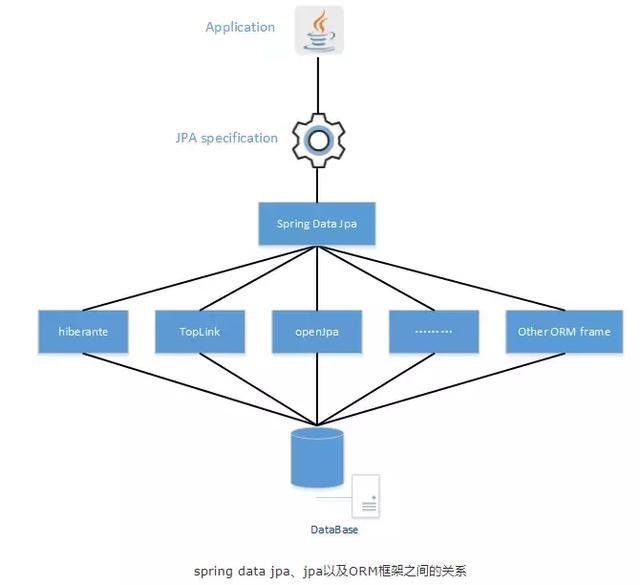

## 八、Spring Data JPA
### JPA:
#### 全稱是Java Persistence API是一個標準規範及接口(API)來實現ORM(object-relational mapping)框架，JPA通過註解(annotation) [如：@Entity、@Table、@Column等註解] 或XML描述物件－關係表的對映關係，並將執行期的實體物件持久化到資料庫中。
#### JPA不是一種框架，而是一個標準規範。而要使用JPA的功能就需要Provider來配合，而Provider就是各種ORM框架。
#### 
### ORM: 
#### Object-relational mapping (ORM) 是一種編程技術，用於配對應用程式模型物件和數據庫表格的資料。
#### Hibernate 是其中一種ORM框架，也是JPA 提供者 (JPA provider)，而JPA Provider還有Eclipse Link (Reference Implementation), OpenJPA 等等。
#### Hibernate 是以Java為基礎的ORM，將Java的物件轉換成數據庫表格的資料，也可以將數據庫表格的資料轉換成Java的物件。
#### 
### 1. 什麼是 Spring Data JPA
#### 不是JPA而是一種技術/模組(module) 。
#### 目的是支援JPA的數據訪問層(Data Access Layer)，以精簡及減少編寫SQL代碼來改善開發者的開發效率
#### 

### 2. [Spring JPA + Hibernate 範例說明](https://matthung0807.blogspot.com/2019/05/spring-boot-2-spring-data-jpa-mysql-8.html "範例教學網頁")
### 3. 練習 -- 使用 Spring JPA + Hibernate 建立一個學生資料表
