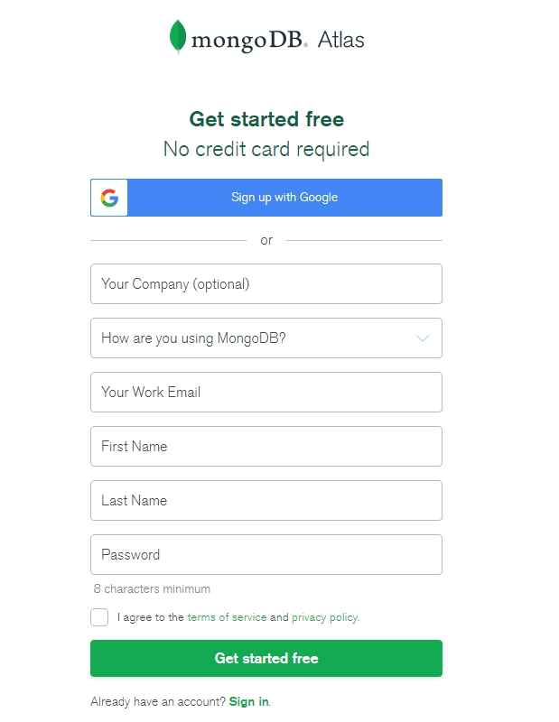

## 九、Spring 整合 MongoDB

### 1. MongoDB 簡介
#### MongoDB 是個開源的 NoSQL (Not only SQL) 資料庫，由於你不需要花很多時間先制定每張資料表要長怎樣、畫出 ER Model，因此不管是用來做 Side-project，還是用來塞大量資料都很適合。
#### MongoDB 是用 Key-value 的方式來儲存資料，長得大概像這樣子：
	{
		name: "NoobTW",
		url: "https://noob.tw"
	}
#### 長的就跟 JSON 沒什麼兩樣。值得注意的是：MongoDB 用的是所謂 BSON 而不是 JSON、每筆資料的 key 和 value 都是區分大小寫的。
##### BSON 是 Binary JSON 的縮寫，就是拿 JSON 下去擴充，所以可以塞 Binary data 等 JSON 不能塞的東西。
#### 在 MongoDB 中，每筆資料稱為一個 Document，大概就是對應到傳統資料庫的 Row。而裝這些 Documents 的叫做 Collection，也差不多可以對應到傳統資料庫的 Table。
#### 資料庫則是一樣叫 Database 了。

### 2. 練習 -- 註冊 Cloud MongoDB 帳號並建立一個專案Cluster 以及 Collection , 學生資料表,並用 Spring Data MongoDB 連線存取學生資料 
#### (1) [MongoDB Atlas](https://www.mongodb.com/cloud/atlas/ "MongoDB Atlas")
#### (2) 註冊:
##### 
#### (3) Login and Build a Cluster (Free)
##### 
